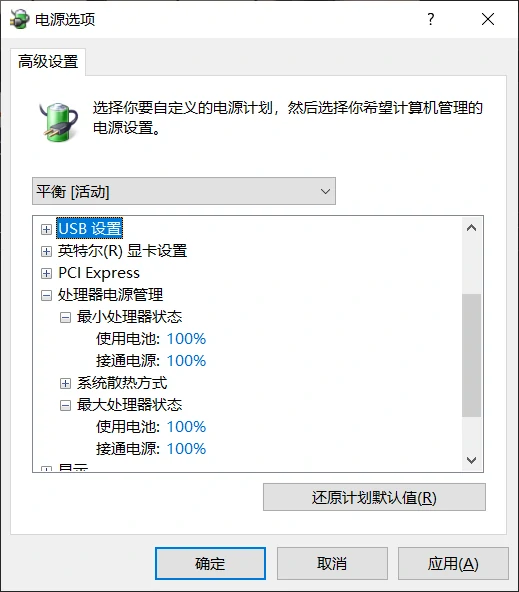

# 问题表现
CPU 占用率 100%，但后台没有高占用软件。

# 解决方法
1. 打开 `控制面板\硬件和声音\电源选项`
2. 选择 `平衡`

# 原因分析
在电源计划的设置中，有一项参数为 `最小处理器状态`。由于有些应用程序需要高性能，它可能会改变系统电源选项，导致这一参数被修改为 100%。

CPU 在这样的设置下会满载运行，即便没有什么可处理的。因此产生了第一张图这种情况。

