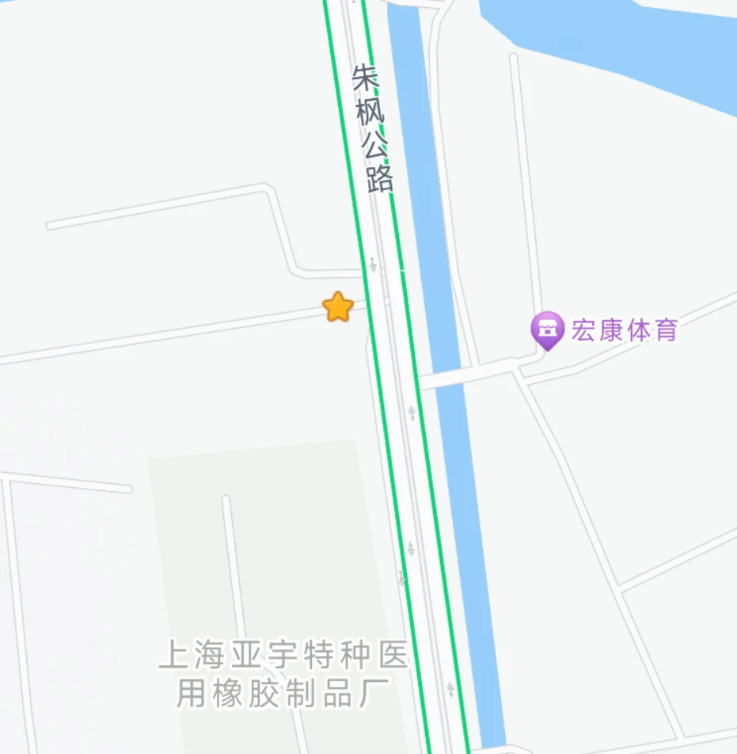
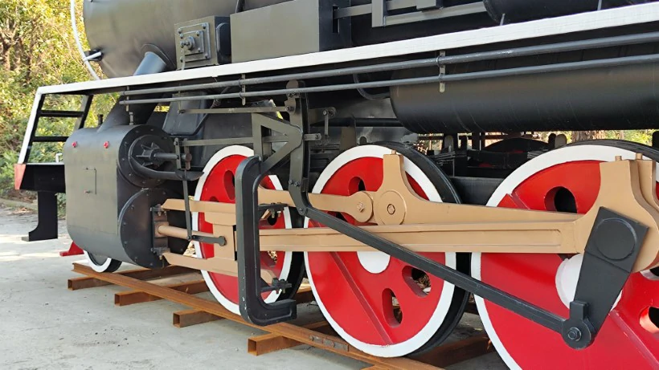
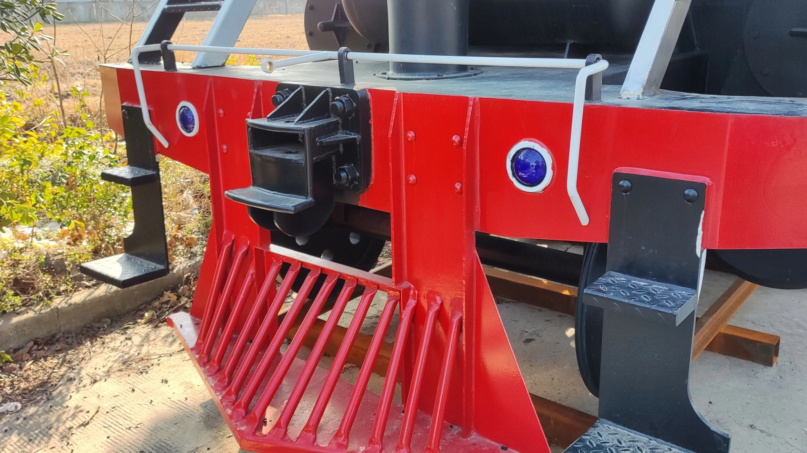
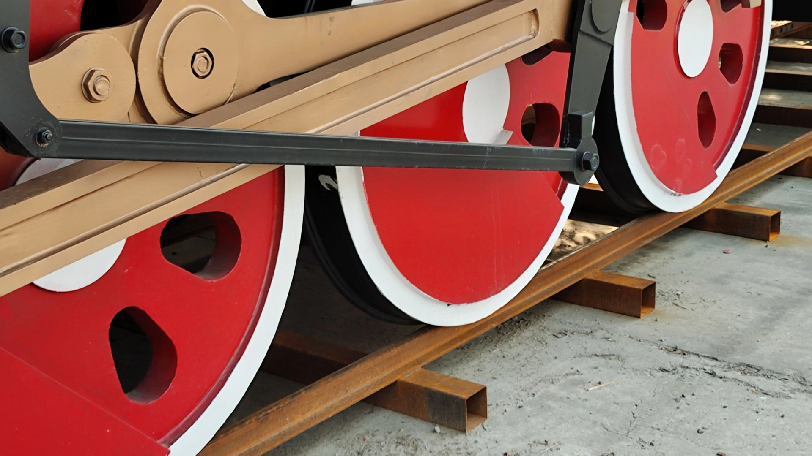
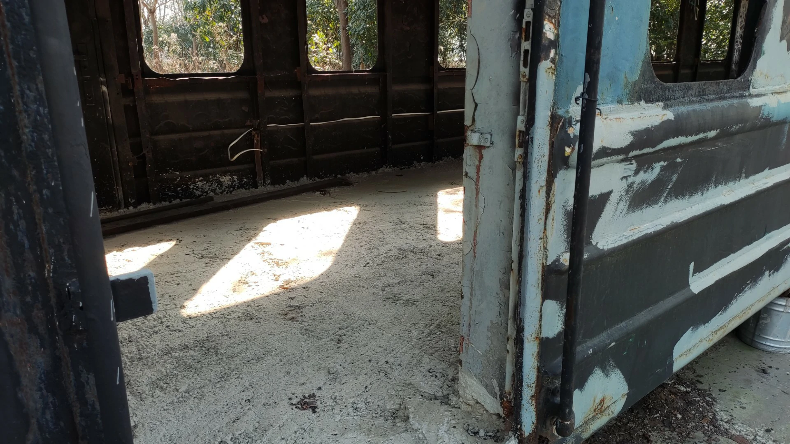
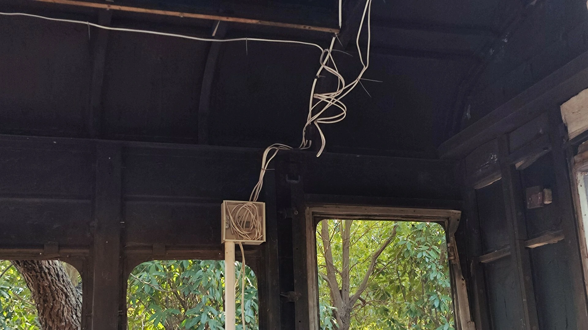
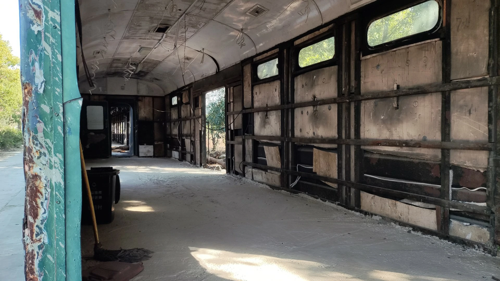
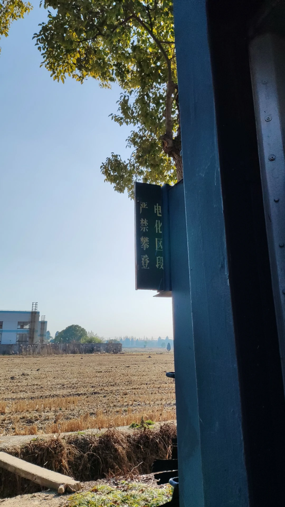

# 缘起

文章的主角 0918 在发布时位于 `上海亚宇特种医用橡胶制品厂（上海市青浦区朱枫公路580号）` 北部的一条小路。

不过根据附近的环境推断，这辆列车很可能在废弃之后被某位老板买下，并临时停在这里进行翻新。笔者在写这篇文章的时候刚完成蒸汽机车的翻新，客运和货运车厢正在翻新。如果你也想来看看，请务必注意文章的时效性。

\*我还是挺想知道这辆车最后会作为什么用的，反正看样子是开不了了（

# 状态

全场约 300 米，有一辆解型放蒸汽机车，很多客运车厢和货运车厢。

## 蒸汽机车

## 未翻新的车厢

