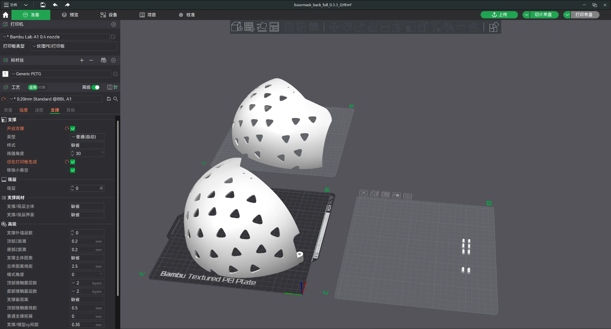
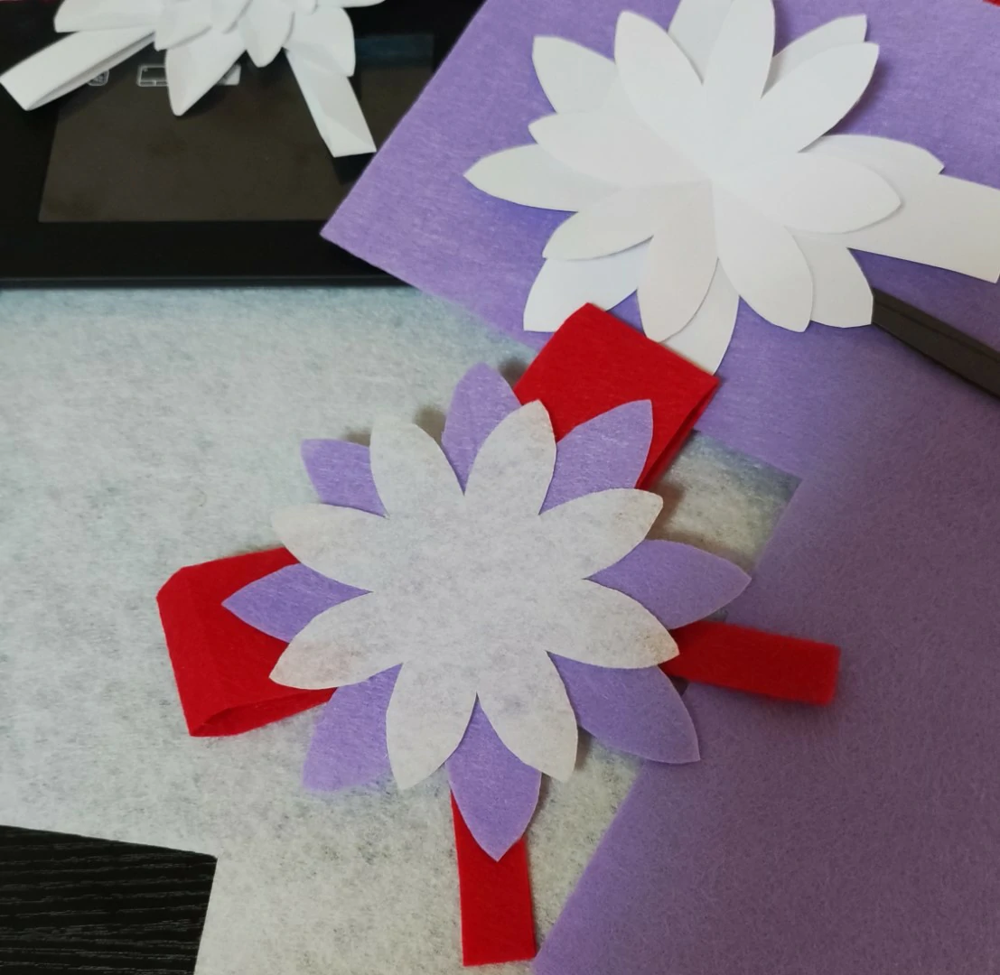
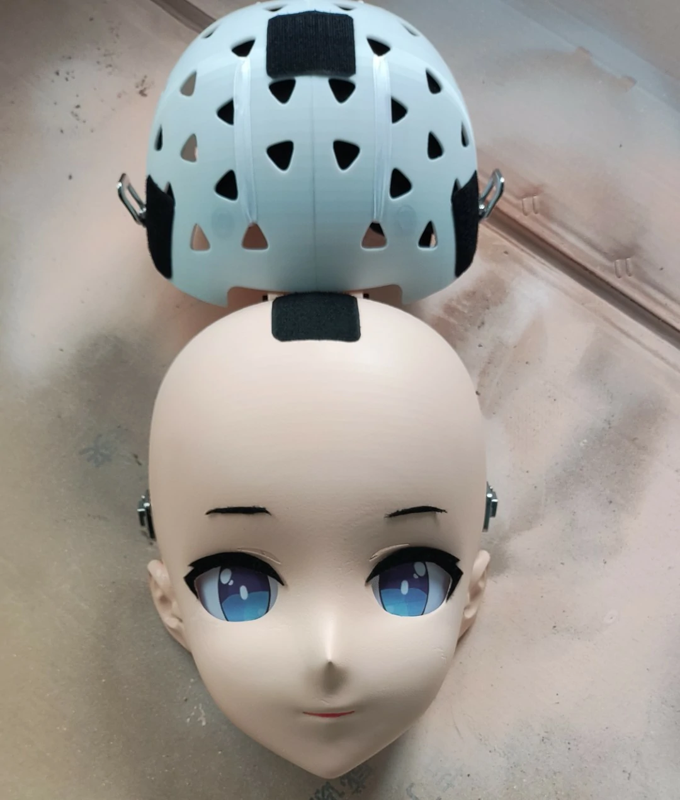
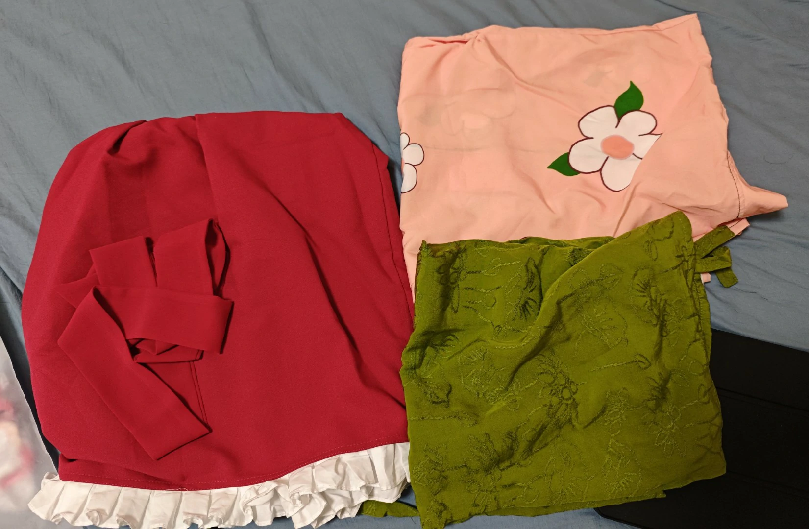
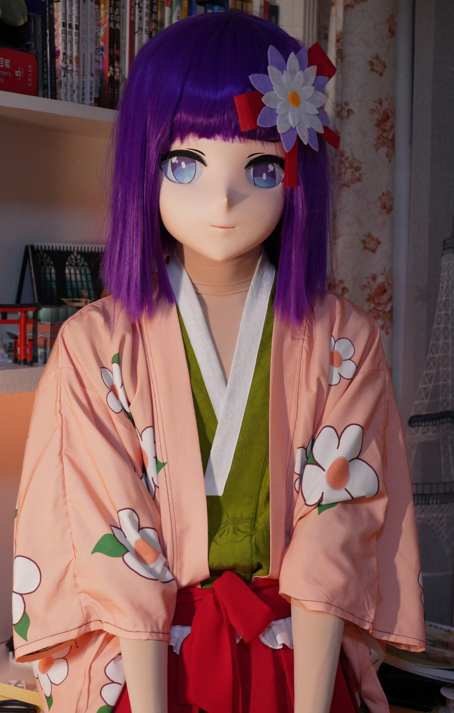

# 缘起（一些闲话）
今年年初的时候，我买了一台 FDM 3D 打印机来玩，来自拓竹的 A1。作为入门级机型算是相当不错的了。


那么既然已经花了大价钱买了台 3D 打印机，肯定是要拿它来整点活出来的。所以在花了一些时间熟悉了切片、材料、打印机工作流程等知识后，我终于是打算开始做点大项目了。  


说起来也巧，刚进入大学的第一年，我结识了不少朋友与同好。其中就有一位 Kigurumi 玩家，也算是我初次了解到 Kigurumi 这个社区。在初步了解了之后，我也有了整一个来玩的打算，果断打开电商平台一看，好家伙，四位数起步，~~告辞（~~

然而作为一个喜欢折腾的人，我当然还有另一个选择，那就是：自制。

于是我就这么踏上了自制 Kigurumi 头壳的旅程（

而在这其中，头壳白模，正好可以用刚学来的 3D 打印制作，那接下来的步骤就比较清晰了。理论可行，实践开始！

# 预算
下面列举了我本次制作所使用的预算，仅供参考。

 - 头壳 **~250r**
   - 打印耗材 50r（如果没有 3D 打印机，则需要更高的价格来获取白模）
   - 假发 42r
   - B603 消光漆 39r
   - 水补土 30r
   - 色漆 15r
   - 砂纸 10r
   - 金属件 10r
   - 颜料 11r
   - PVC 网 4r
   - 不织布 13r
   - 海绵 10r
   - 磁铁 2r
   - 魔术贴 8r
 - Kigurumi 皮 **~380r**
 - Cosplay 服饰 & 各种饰品 **~400r**

**共计 1k 左右。**

# 头壳制作
下面是详细的制作过程，如果你想作为参考的话，建议完整看一遍内容，再着手制作。

## 0. 角色的选择
在开工之前，先挑一个你想做的角色吧。如果对自己的水平不自信的话，可以挑一个做起来比较简单的（

我这次选择的角色 **稗田阿求（东方 Project)** 算是比较好上手的了，发型简单，发饰简单，并没什么特别的细节。


## 1. 制作白模

### 模型
白模的模型的获取实际上是一件比较麻烦的事情，并不是所有人都有合格的美术和建模基础。但好在有前辈分享了一些免费开源的头壳模型，给了刚入门自制头壳的玩家一个非常好的选择，在此感谢这些分享者们。

这里是一些我找到的开源头壳模型（仅为一小部分）：
 - https://www.thingiverse.com/thing:5316376 (@Leide)
 - https://github.com/vuicoo/plumKigurumi- (@vuicoo)
 - https://github.com/AEMShana/ArisakaMashiroKigurumi (@AEMShana)

在选择头壳模型的时候，需要注意以下几点：
 - **头围**
 至少要保证头壳适用头围大于等于你的头围，不然头壳做出来戴不上去就麻烦了。就算头壳头围比你的头围大也没关系，后续可以通过海绵调整。

 - **头壳类型（半面、3/4 头、全头）**
 半面制作成本低，但呈现效果并不算太好，如果是自己做的话并不推荐。后两者则效果相差不大，全头相对更好一点，但是也会更热，可以自行衡量二者。

 - **脸型**
 如果你选择了能进行脸型自定义的模型的话，可以花点时间为角色选一个适合的脸型。

### 关于打印机的构建尺寸
我手上这台打印机的构建尺寸为 256mm^3，属于勉强足够打印头壳的尺寸。如果你的打印机构建尺寸小于 256mm^3 的话，可能就需要考虑分件或直接找代打了。

### 切片
我这次制作的头壳使用了 @Leide 大佬的模型，下面是我切片的方式，仅供参考。

#### 前壳

> 打印头：0.4
> 层高：0.2
> 支撑：标准、仅打印板
> 支撑屏蔽：左右两侧的各个孔洞
> 墙层数：3


#### 后壳

> 打印头：0.4
> 层高：0.2
> 支撑：标准、仅打印板
> 墙层数：3
> 切分：中间切开、栓连接

由于全头后壳比较大，而且对外观没有太大的需求，所以这里我选择了切分打印。



### 耗材的选择
能用光固化打自然是最好的，但 FDM 也没问题。我选择了 PETG 作为打印材料，但后续发现 PETG 打磨起来很费力。所以这里我更推荐使用 PLA，虽然会牺牲一定的强度，但能让打磨过程比较轻松。

### 开始打印！
一切就绪之后，接下来就交给 3D 打印机吧。把打印机放到一个不会被打断的地方，然后静静等待即可。


## 2. 头壳所需的金属件
在等待头壳打印的时候，可以打开购物平台购买一些需要的材料了。

一般的头壳都会有两处需要金属件连接的地方：
 - 顶部转轴
 - 左右两侧的卡扣

详细的参数可以参考模型的说明，我使用的这个模型需要：
 - M4*60 半牙螺栓 *1
 - M3 螺丝+螺母 *4
 - 中箱扣 3018 *2

## 3. 组装头壳
使用事先准备的连接栓进行定位，然后往缝隙中填入 502 胶水进行固定，最后装上卡扣，后壳就准备完毕了。


在前壳上装上卡扣的另一部分，然后将顶部连接螺丝安装到位，头壳就组装完成了。


## 4. 补土&打磨&喷漆
这可能是对于初次制作头壳的玩家来说最难的一步了，具体操作可以参考 [这篇教程](https://how.kig.land/DIY/Tips-for-painting) 以及网上的各种自喷漆视频教程，这里我只写一些原文没提到的东西。

### 低成本的喷漆选择
对于想要低成本制作头壳的玩家来说，郡士的自喷漆价格有点偏贵。经过我的实践，以下是一个可行的低成本喷漆方案：
```水补土 -> 打磨 -> 三和 40#白色（也可以用白色水补土替代） -> 三和 313#浅粉色 -> 消光漆```

### 注意事项
1. **不要在喷漆没干的时候接触漆面！**
2. 不要在高湿度天气下使用消光漆！
3. 注意个人防护


## 5. 面妆
这一步是可选的，合适的面妆能给头壳增加生动感。

不过不管怎么说，嘴唇部分还是建议画一下的。直接使用丙烯颜料，调一个合适的颜色，然后往头壳上画一笔即可。


## 6. 眼片
可以去购物平台购买 PVC 防尘网作为眼片的基底，我选择的是 0.5mm 孔径。固定方式可以选择胶带/热熔胶/磁铁，总之可以自行发挥创意（


关于眼片素材，可以选择从现成的插图素材里扣，或者也可以自己画。调整好大小之后打印到不干胶打印纸上，裁剪下来并粘贴即可。


## 7. 睫毛
将黑色不织布裁剪成合适的形状，然后粘贴到头壳上即可。可以先在普通的纸上用铅笔打个草稿。


## 8. 调整海绵
在购物平台上购买一点中高密度海绵来作为头壳内部的缓冲材料，增加舒适度，同时也能让头壳更贴合。可以用绑带固定，也可以用纳米胶（传统的双面胶是很难黏住的）。

由于装上了假发之后这一步会很难进行，所以强烈建议在装假发之前就把海绵调整到舒适贴合的程度。


## 9. 饰品
不同的角色要准备不同的饰品，所以这一步就留给各位自由发挥了。




## 10. 假发
自制头壳的又一大难点。由于头壳的头围比普通人大一圈，传统的假发在头壳上会显得很奇怪，所以我们就只能自己修头发了。但又由于我们低成本的原则，购买昂贵的 kig 专用假发并不合适，所以我就选择了以下方案。

首先去购物平台购买一顶正常头围的假发，但需要选择长度稍长，发量多一些的未修剪假发。接下来用四个魔术贴分别固定在头壳的上下左右四个位置，同时将另一面固定到假发发网上，然将假发与头壳上的魔术贴对准并粘贴，这样就实现了在头壳上使用正常头围的假发。


接下来对假发进行修剪，详细步骤仍然是建议参考网上的各种教程，由于本人也技术不精，这里就不误人子弟了（


---

至此，头壳的部分就算是完成了。


# 后续的工作
头壳完成之后，还需要一些后续步骤。

## Kig 皮
所谓的 Kig 皮其实就是一套肉粉色紧身衣，可以让头壳和皮肤的颜色匹配度更高。由于 Kig 皮个人制作难度较高，且价格相对定制头壳来说还是可以接受的（~400），所以这里我还是推荐找专门的店家定制。详情可以参考 [这篇文章](https://how.kig.land/get-start#-%E4%BB%8E-kigurumi-%E7%B4%A7%E8%BA%AB%E8%A1%A3%E5%BA%97%E5%AE%B6%E9%87%87%E8%B4%AD%E7%9A%AE)。

## Cosplay 服饰
准备 Cosplay 服饰反而是比较简单的一件事情了，选择合适的尺寸，找店家制作即可（只要是本人能穿的下的尺寸就能给 Kig 穿）。


# 一切就绪！
如果你跟着做到了这里，**那么恭喜你！**你可以开始你的 Kigurumi 之旅了。


# 最后的最后
如果你还有其他本文未提及的问题，也可以直接来问我。你可以加 `QQ2114085565` 或发邮件到 `ltfjx2333@gmail.com`。  

**祝玩的开心：D**